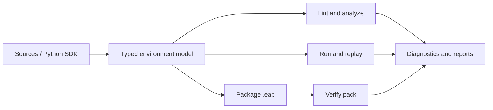

```
               _____  ___   _____   __________  _____  ____
              / __/ |/ / | / / _ | / __/ __/ / / / _ \/ __/
             / _//    /| |/ / __ |_\ \_\ \/ /_/ / , _/ _/
            /___/_/|_/ |___/_/ |_/___/___/\____/_/|_/___/

                 Environment Assurance Compiler  ·  eac
```

[](https://github.com/fraware/environment-assurance-compiler/actions/workflows/ci.yml)
[](LICENSE)
[](https://www.python.org/downloads/)
[](https://github.com/fraware/environment-assurance-compiler)
[](https://github.com/fraware/environment-assurance-compiler)

**EnvAssure** turns the messy evidence of real systems — API contracts, schemas,
procedures, traces, and human decisions — into a **typed environment model** you
can lint, run, package, and verify.

It is for people building **agent evaluations**, **simulations**, and
**environment packs** who need more than a hand-waved mock: clear state and
actions, provenance for what you know (and what you don't), and artifacts you can
inspect in CI.

> Pre-alpha (`0.2.0.dev0`). The core compile → lint → run → package loop works today.
> APIs and schemas may still change. Building a pack does **not** mean the
> environment is high-fidelity — that claim needs evidence.

---

## Why it exists

Agent and simulation work often stalls on the same questions:

- What state and actions actually exist?
- Which parts of the model came from a contract, a SOP, a trace, or a guess?
- Where do sources conflict or leave gaps?
- Can the compiled model run the sequences you care about?
- What can you honestly claim about fidelity?

EnvAssure is a **local-first compiler** for those questions. It does not train
models, serve agents, or grade you with a single fidelity number.

## What you get

| Output | What it means in practice |
| ------ | ------------------------- |
| Typed environment model | Versioned JSON describing state, actors, actions, tasks, and constraints |
| Reference runtime | Event-sourced execution so you can `eac run` action sequences locally |
| Diagnostics | Stable, actionable findings from lint and static analysis |
| Packs (`.eap`) | Lockable artifacts you can verify before trust |
| Provenance | Links from model elements back to sources and expert decisions |

```text
  sources / SDK     typed model      runtime + packs
  ------------>     -----------      ---------------
  OpenAPI, SOPs  ->  world.json  ->  run / lint / package
  traces, DDL        + provenance    verify / reports
```

## Install

Requires **Python 3.11, 3.12, or 3.13**.

```bash
git clone https://github.com/fraware/environment-assurance-compiler.git
cd environment-assurance-compiler
pip install -e ".[dev]"
eac --help
```

Optional extras (lazy-imported; fail closed when missing):

| Extra | Provides |
| ----- | -------- |
| `gym` | Gymnasium adapter |
| `pettingzoo` | PettingZoo adapter |
| `postgres` | Postgres DDL import + opt-in connector |
| `model-assisted` | HTTP proposal provider (`httpx`); stub works without it |
| `opa` | OPA obligation backend helpers; evaluation/tests require a system OPA binary |
| `openenv` | OpenEnv adapter (`openenv==0.4.1`) + Gymnasium |
| `docs` | MkDocs Material for local doc builds |

```bash
pip install -e ".[gym,pettingzoo,postgres,model-assisted,opa,openenv,docs]"
```

## Quick start (about 60 seconds)

From the repository root:

```bash
# Compile the counter example into a typed environment model
eac build-ir --module examples/counter/world.py -o examples/counter/ir/world.json

# Check structure
eac lint examples/counter/ir/world.json

# Run two increments (comma-separated action ids; also accepts actor:action)
eac run examples/counter/ir/world.json -a increment,increment

# Package and verify
eac package examples/counter/ir/world.json -o counter.eap
eac verify-pack counter.eap
```

Start a fresh workspace when you are ready to author your own environment:

```bash
eac init my-env && cd my-env && eac doctor
```

Model upgrades are **explicit only** — lint, verify, and load never silently migrate:

```bash
eac migrate path/to/world.json -o path/to/world.migrated.json
```

## How the pieces fit



More examples live under [`examples/`](examples/): deterministic counter, auth
flows, conflicting refund sources, and stochastic inventory.

## Documentation

| Topic | Link |
| ----- | ---- |
| Getting started | [`docs/getting-started.md`](docs/getting-started.md) |
| Docs home | [`docs/`](docs/) |
| Compatibility | [`docs/compatibility.md`](docs/compatibility.md) |
| Validation and fidelity | [`docs/concepts/validation-and-fidelity.md`](docs/concepts/validation-and-fidelity.md) |
| Threat model | [`docs/security/threat-model.md`](docs/security/threat-model.md) |
| Design records | [`adrs/`](adrs/) |
| Examples | [`examples/`](examples/) |

Build the docs site locally:

```bash
pip install -e ".[docs]"
mkdocs build --strict
mkdocs serve
```

## What EnvAssure is not

- Not an RL trainer or model-serving platform
- Not a proof assistant
- Not a single-score fidelity leaderboard

Successful `build-ir` / `lint` / `package` means artifacts are well-formed enough
to inspect — not that they match production behavior. See
[Validation and fidelity](docs/concepts/validation-and-fidelity.md).

## Contributing

EnvAssure is early, and that is exactly when contributions matter most. If you
care about honest environment tooling for agents and simulations, you are in the
right place.

**High-impact ways to help:**

- **Adapters** — import paths for OpenAPI, procedures, traces, databases, policies
- **Examples** — small, real-feeling worlds that exercise the compile → run → pack loop
- **Diagnostics** — clearer findings and suggested repairs
- **Docs** — guides, concepts, and CLI accuracy
- **Runtime adapters** — Gymnasium, PettingZoo, and related surfaces

```bash
pip install -e ".[dev]"
ruff check src tests
mypy
pytest
```

CI runs on Python 3.11, 3.12, and 3.13
([`.github/workflows/ci.yml`](.github/workflows/ci.yml)).

Good first paths: fix a docs mismatch, add an example, or improve a diagnostic
message. See [CONTRIBUTING.md](CONTRIBUTING.md) and the
[Code of Conduct](CODE_OF_CONDUCT.md). Report vulnerabilities privately via
[SECURITY.md](SECURITY.md).

## License

Apache-2.0. See [LICENSE](LICENSE).
